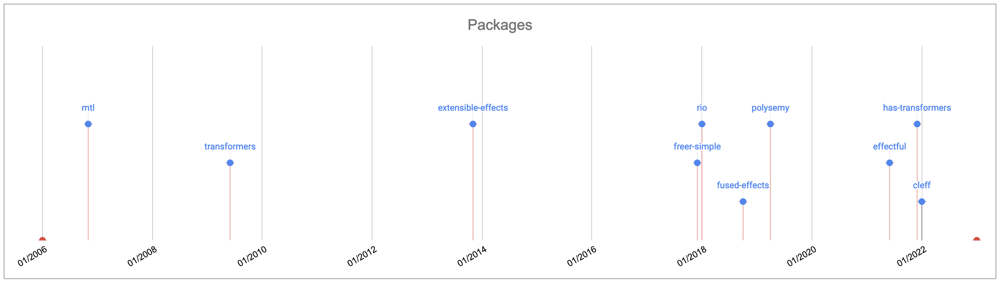
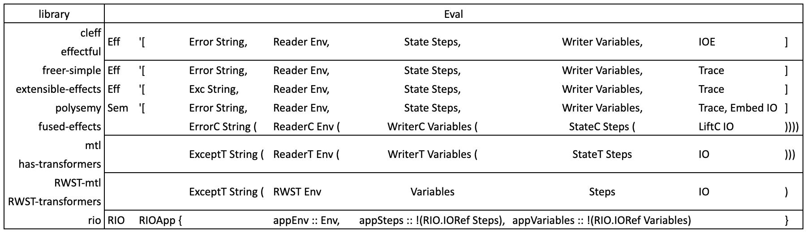
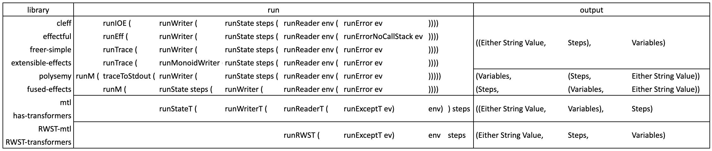
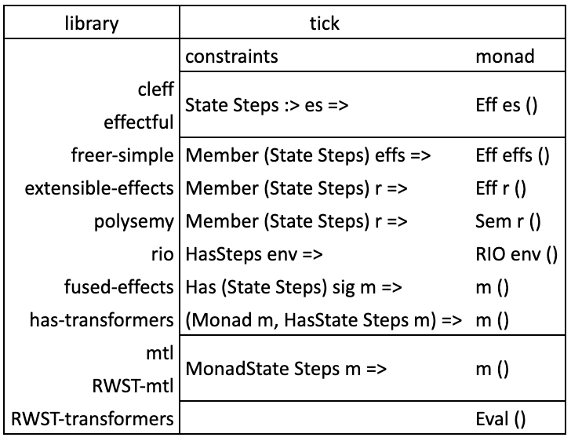
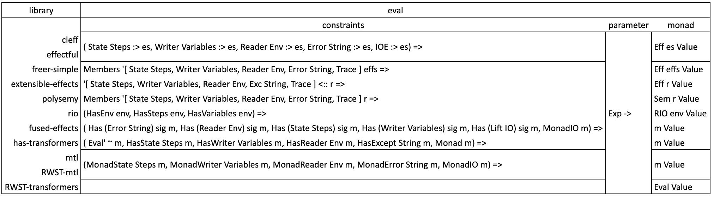

# One Step Beyond

In 2006, Martin Grabmüller published his paper ["Monad Transformers Step by Step"](https://web.archive.org/web/20170720145439/http://catamorph.de/documents/Transformers.pdf). He did a great job explaining how to use monad transformers. One at a time, he added error handling, environment passing, state, logging and input/output. Sure, these features are a small subset of what we find in a real application. Yet, combined, they form a kind of reusable backbone to start using Haskell in production.

Since then, people explored other approaches. Today, if you want to choose a library to build an application upon, you will have to consider a lot of contenders. We can't just hope companies will make a good guess without guidance. Consequences are far-reaching: what if it is difficult to make a choice or if it ends up with hard to maintain code? Employers will not incline to use Haskell in their projects, whatever its strengths. To get more job offers, Haskell needs to be picked more. This will only happen if we ease this choice by being crystal clear upfront about what to expect.

While commendable, library authors documentation efforts are often not enough. Users are rarely experts in the field, they can't weigh design choices' explanations. A 20 lines example is too narrow. It does not help to answer these questions: How do I translate it into my much more elaborate effects? How do I compare this library to this other? What are the pain points I will have to deal with? OK, I am looking for a library to ease my job, but it's what I will find not documented in this README I should worry about.

Many reports have already demonstrated effects libraries are production ready. I can vouch for it, since at my work we use one of them for many things. Cloud: reading different configurations. Kafka: consuming and producing messages. HTTP: serving an API and doing requests. DB: storing and querying data, managing locks on resources. Other: logging with timestamps, random UUIDs generation, asynchronous processes and batch processing parallelization. We use Different interpreters for tests. So the problem is not "should I use an effect library?" but "how do I compare the pros and cons of these libraries to find the one fitting my project and my team skills?". To be impartial, library authors can't give the answer, it is the duty of users, as a community effort.

This article and code base scaffold this answer to reach production ready libraries. [Simple Haskell](https://www.simplehaskell.org/) principles define it: accessibility, maturity and assessed leaking complexity. Like "Monad Transformers Step by Step", we concern ourselves with usage, not implementation. First, I use 10 libraries to duplicate Martin Grabmüller's example and show how they differ in their usage. Then, I pick one at random to illustrate one kind of surprises which may pop up, its explanation and how to fix it. In conclusion, I give comments on how to standardize library usage to ease their adoption.

We have to expand This Rosetta Stone. Its template makes it easy to contribute, I describe how at the end.

First, let's have a quick look at their first release on Hackage.

## Libraries Timeline



It all started in November 2006, with `mtl` (an acronym for Monad Transformers Library). Its design evolved to use GHC extensions, breaking compatibility with Haskell98. To keep it, a split called `transformers` appeared 2 years and a half later in June 2009. After, everything stayed quiet for a while.

Then `extensible-effects` shook the status quo in November 2013. It presented itself as an alternative to Monad Transformers.

This new approach sank in and produced a second wave of releases from December 2017 to April 2019. Most new packages adopted the same design, with the notable exception of `rio`. This package took the opposite direction of Monad Transformers. It throws away stacked monads and keeps only the `Reader` monad on top of `IO`, hence the `RIO` monad.

A third wave started in June 2021 with `effectful` and stopped a year ago, in January 2022, with `cleff`. These two packages are very similar in their usage, but not in their implementation. Performance is not optimal in the design introduced by `extensible-effects`. To reach better ones, the latter reuses `rio`'s design choice.

## Code Benchmark

### Reference Example Explained

Our reference code is Martin Grabmüller's example.  It is only dusted (newer versions of `mtl` deprecated and removed`Control.Monad.Error`).  
We have an `Exp` as input:

```Haskell
type Name = String -- variable names

data Exp
  = Lit Integer -- expressions
  | Var Name
  | Plus Exp Exp
  | Abs Name Exp
  | App Exp Exp
  deriving (Show)
````

And a `Value` as output:

```Haskell
data Value
  = IntVal Integer -- values
  | FunVal Env Name Exp
  deriving (Show)

type Env = Map.Map Name Value -- mapping from names to values
````

The app wraps this result in a monad stack:

```Haskell
eval :: Exp -> Eval Value
```

Where `Eval` bashfully hides:

```Haskell
type Eval a = ExceptT String (ReaderT Env (WriterT Variables (StateT Steps IO))) a
```

We do not describe the `Exp` sum type because we are not interested in the app itself (the paper linked on top does it). But what effects does it use?

#### Effects Used

We will decompose our `Eval a` type from inside to outside.

Our first transformer is a `StateT Steps`. Each sub-expression increment, or tick, a counter `Steps` (`type Steps = Integer`).

Next one is `WriterT Variables`. We output each variable name `Var Name` in a list of `Variables`. We do it with `tell [n]`, `n` being a `String` (`type Variables = [Name]` and `type Name = String`).

Then we have a `ReaderT Env` which keeps track of temporary results tied to variable names. `Env` is a mapping from names to values. We get it with `ask` and change it locally in a sub-expression with `local`.

`ExceptT String` wraps all these effects. A malformed expression raises an error with a description.

But this is not the last effect: we use our base monad `IO` to print some debug information. In this case, we lift `putStrLn` through the stack with `liftIO`.  
Other libraries often handle it in a dedicated `Logging` effect. Then, we may interpret it in `IO` or another monad (tests could do it with a `Writer [String]` for example).

#### Input

To be able to run our application, it needs some initialization.  
`ExceptT String` and `WriterT Variables` don't need one. They only output their parameterized type.

But our mapping from names to values used in `ReaderT Env` is empty before the evaluation starts. And our `StateT Steps` counter is set to 0.

With this out of the way, we are able to plug our `eval :: Exp -> Eval Value` function with an expression and get a result back:

```Haskell
runEval :: Env -> Steps -> Eval Value -> IO _
```

What is its type?

#### Output

This hole stands for:

```Haskell
_ :: (Either String Value, Steps, Variables)
```

Where `Either` catches any error raised in its `Left` side and a `Value` result in its `Right` side. The second value in this tuple is the counter and the third, variables name collected along the way.

#### Running The Application

To get a result, we need to peel each level of the stack. On our way, we collect effect output if the current transformer provides one. For our reference code, we do `runStateT (runWriterT (runReaderT (runExceptT ev) env)) steps`.

We want all libraries to produce the same output, and sometimes plumbing is necessary. Here, we need a lambda to remove the inner tuple: `\((result, variables), steps') -> (result, steps', variables)`.  
Why not keep our reference code output as is? It feels more coherent to use the `RWST` monad flat tuple output as reference. Both `mtl` and `transformers` implementation share it and embed almost all transformers used.

Gathering all, we get this function:

```Haskell
runEval :: Env -> Steps -> Eval Value -> IO (Either String Value, Steps, Variables)
runEval env steps ev =
  (\((result, variables), steps') -> (result, steps', variables))
    <$> runStateT (runWriterT (runReaderT (runExceptT ev) env)) steps
```

#### Result

If you want to have a look at and run this code on your computer, open a terminal and type `cabal run v0`. Otherwise, here is the output from Martin Grabmüller's code. Beside the first line, other libraries output is identical.

``` console
0. original (mtl)
Wrong expression
----------------
input:Var "x"

Evaluation:

output:(Left "unbound variable: x",1,["x"])

Steps: 1
Variables: ["x"]
Result: Left "unbound variable: x"


Valid expression (IntVal)
-------------------------
input:Plus (Lit 12) (App (Abs "x" (Var "x")) (Plus (Lit 4) (Lit 2)))

Evaluation:
Lit: 12
Lit: 4
Lit: 2
Step: 7
Current env: fromList []
Modified env: fromList [("x",IntVal 6)]

output:(Right (IntVal 18),8,["x"])

Steps: 8
Variables: ["x"]
Result: Right (IntVal 18)


Valid expression (FunVal)
-------------------------
input:Abs "x" (Var "x")

Evaluation:

output:(Right (FunVal (fromList []) "x" (Var "x")),1,[])

Steps: 1
Variables: []
Result: Right (FunVal (fromList []) "x" (Var "x"))
```

### Benchmark Template Structure

Our benchmark template requires fewer explanations.

Each library version has 2 modules. One in [`Internal`](Internal/) to hide specific imports and align bits of code to match our reference code. We name the other according to the `App<LibraryName>.hs` format. Besides imports, it contains only 4 things:

- its `Eval a` type,
- its `runEval` implementation,
- the `tick` and `eval` functions with their signatures

`tick` and `eval` functions have the same implementation for all libraries. They only differ by their signatures.

This is where the template resides. The central piece is our application, the evaluation function. In the former module, we hide implementation details from it. In the latter one, we expose only essential characteristics of the library to run it. That is, the `runEval` function using the `Eval a` type and necessary signatures for `tick` and `eval`.

This same format for each `App<LibraryName>.hs` module results in a very uniform and boring [`Main.hs`](Main.hs) module. We call all libraries in the exact same way, the expected signature of a benchmark.

What benefits do we get from this common setting? A user is able to focus on the library interface on one side, and what he needs to know of its `Internal`s on the other side.  
Also, it highlights similarities to help establish standards for effect libraries interface.

So, what does this code reveal?

## Observations

### Interfaces

#### `Eval a` type

All libraries expose effects at play in the `Eval a` type, excepted `rio`. For it, it is one level below, in the fields of the record type in use.



Besides this exception, we have 2 categories of display:

- the "onion" way: `mtl`, `transformers`, `fused-effects` and `has-transformers`
- the list way: `extensible-effects`, `freer-simple`, `polysemy`, `effectful` and `cleff`

What if we put aside naming differences and the flattening done by RWST versions? Then, only `polysemy` and `fused-effects` use an extra effect in their types. So we can say a great deal of standardization is quite easy in that area.

#### `runEval` function



We find back our 3 outsiders: `polysemy` (list way), `fused-effects` ("onion" way) and `rio`. This last one is so different that it is not included in the table. For completeness, here is its code:

```Haskell
runEval env steps ev = do
  app <- liftA3 RIOApp (pure env) (newIORef steps) (newIORef [])
  liftA3
    (,,)
    (first (show @EvalException) <$> try (runRIO app ev))
    (readIORef (app ^. stepsL))
    (readIORef (app ^. varsL))
```

#### Signatures

`tick` and `eval` signatures are also interesting to examine. `tick` involves only one effect and `eval` many.

##### `tick`



Besides `transformers`, it is easy to describe involved effects in a signature.

As often, `cleff` and `effectful` are identical. We could say that `extensible-effects`, `freer-simple` and `polysemy` are very similar too. It becomes clear if we replace `Member` by the type operator `:>` and do some renaming.

##### `eval`



Same remark as above about almost identical signatures.

Some formats would definitely need some refactoring.

### Implementations

Since we are considering library usage, implementations in [`Internal`](Internal/) folder are not analyzed.

Now, you may have noticed that many export a delegation to the `get` function of the `State` monad. For someone used to effect libraries, it seems completely useless.

In fact, it serves 2 purposes. First, having exactly the same `tick` and `eval` implementations, whatever the library used.

The second one is also quite important. It introduces the surprise promised in the introduction.

## Undocumented Panicking Error Messages For Well-Known Problems

Take [`AppFreerSimple.hs`](AppFreerSimple.hs) for example. If you switch back to the library version of `get` and try to compile, you will have this error:

```Console
app/AppFreerSimple.hs:59:15: error:
    • Overlapping instances for Member (State a0) effs
        arising from a use of ‘get’
      Matching instances:
        instance (Data.OpenUnion.Internal.FindElem t r,
                  Data.OpenUnion.Internal.IfNotFound t r r) =>
                 Member t r
          -- Defined in ‘Data.OpenUnion.Internal’
      There exists a (perhaps superclass) match:
        from the context: Members
                            '[State Steps, Writer Variables, Reader Env, Error String, Trace]
                            effs
          bound by the type signature for:
                     eval :: forall (effs :: [* -> *]).
                             Members
                               '[State Steps, Writer Variables, Reader Env, Error String, Trace]
                               effs =>
                             Exp -> Eff effs Value
          at app/AppFreerSimple.hs:(19,1)-(29,16)
      (The choice depends on the instantiation of ‘a0, effs’
       To pick the first instance above, use IncoherentInstances
       when compiling the other instance declarations)
    • In a stmt of a 'do' block: step <- get
      In the expression:
        do step <- get
           embeddedLog ("Step: " <> show step)
           embeddedLog ("Current env: " <> show env')
           embeddedLog ("Modified env: " <> show (Map.insert n val2 env'))
           ....
      In a case alternative:
          FunVal env' n body
            -> do step <- get
                  embeddedLog ("Step: " <> show step)
                  embeddedLog ("Current env: " <> show env')
                  ....
   |
59 |       step <- get
   |               ^^^

app/AppFreerSimple.hs:60:32: error:
    • Could not deduce (Show a0) arising from a use of ‘show’
      from the context: Members
                          '[State Steps, Writer Variables, Reader Env, Error String, Trace]
                          effs
        bound by the type signature for:
                   eval :: forall (effs :: [* -> *]).
                           Members
                             '[State Steps, Writer Variables, Reader Env, Error String, Trace]
                             effs =>
                           Exp -> Eff effs Value
        at app/AppFreerSimple.hs:(19,1)-(29,16)
      The type variable ‘a0’ is ambiguous
      Relevant bindings include
        step :: a0 (bound at app/AppFreerSimple.hs:59:7)
      These potential instances exist:
        instance (Show a, Show b) => Show (Either a b)
          -- Defined in ‘Data.Either’
        instance (Show k, Show a) => Show (Map.Map k a)
          -- Defined in ‘Data.Map.Internal’
        instance Show Ordering -- Defined in ‘GHC.Show’
        ...plus 27 others
        ...plus 40 instances involving out-of-scope types
        (use -fprint-potential-instances to see them all)
    • In the second argument of ‘(<>)’, namely ‘show step’
      In the first argument of ‘embeddedLog’, namely
        ‘("Step: " <> show step)’
      In a stmt of a 'do' block: embeddedLog ("Step: " <> show step)
   |
60 |       embeddedLog ("Step: " <> show step)
   |                                ^^^^
```

Imagine you are starting to use one of these libraries, and you stumble upon this error. What would be your feeling? You would naturally think you must use it in a very wrong way, you don't have the necessary theoretical knowledge, etc. and you would be wrong.

Obscure error messages like these are not new, but knowing how to deal with it or not makes a big difference.  
Let's say your team discovers an effect system. You add a lot of moving parts to absorb to an agenda already crowded with features to produce. Now, you have to search in the wrong direction for complicated answers. Because anyone will imagine that it must be the kind of answers to look for, after being yelled upon this way.
In production, it is not an option to lose time, nerves, and energy at random. So doubts start to crop, this is not good.

Here we face a typical case of leaking complexity, and it is sad, because the fix is so simple. We lose type inference. Compare these 2 signatures:

```Haskell
get :: Member (State s) effs => Eff effs s
get :: Member (State Steps) effs => Eff effs Steps
```

The first one is polymorphic, it comes from the library. The second one is monomorphic, this is the one we export from the [`FreerSimple.hs`](Internal/FreerSimple.hs) module. It makes explicit `State`'s parameter type.

When you first meet this error, it has a real deceiving effect. The signature of the `eval` function, where it occurs, mentions in an explicit way `State Steps`. Come on GHC! How can't you find this type? It is under your nose! Terrible.

The [`Inference`](/inference/Main.hs) application gives various ways to fix the problem. I use`freer-simple` for illustration purpose. All libraries of its kind suffer from the same issue.

_As a last and side note, I read the problem comes from the fact the list of effects is extensible. Thus, it may contain duplicate monads: `State Integer` and `State Bool` for instance. It left me wondering.  
I understand a library author cannot guess how developers will  use it. But, a library user does not expect to deal with a list of unknown effects. Why not use a type level Set instead of a List? Could it not drive inference?_

Of course, we can't avoid all these errors, it is too much work. And, for sure, it is not the duty of library authors if it does not come from their code. But if some pop up often, we can at least document them. Why not here?

## Conclusion

This is already a long article, and yet we could and should add to it to soften the rough edges in this matter. It would ease the mental effort for companies to switch and stick to Haskell. Following the 20/80 rule, or Pareto principle, we just need to focus on a few issues to see great improvements. An obvious one would be more applications using Haskell, and more job offers as corollary. It is important for us, developers, and it means we also have to take into account our employers' needs. It will be easier for them to hire and keep people already acquainted with effect systems simpler to use.

What could we do? Expand this benchmark with other libraries. Write a set of effects in all libraries, like the common TODO list. It would spot their strengths and weaknesses, which then we could address. Explain usual error messages and their solution would help a lot. Remove insignificant differences would improve their interface and harmonize their usage.

This is not a big work for a community, yet it would be a great step beyond.

## Contributing

### Adding a library

Anyone familiar with another library may add it with ease to this list with a Pull Request.

All you have to do is plug this library into [`effects-landscape.cabal`](/effects-landscape.cabal). Then, write the [`Internal`](Internal/)`/<OtherLibrary>.hs` and `App<OtherLibrary>.hs` modules. Call the latter in [`Main.hs`](Main.hs) and run it to check its behavior.

A short update of this `README.md` file will mention usage characteristics.

### Adding an error message

If you are a user of one of the library in the list and meet an error message, you could fill an issue in this repository.

Feel free to add it, even if you are not sure that it comes from the use of the library. Whether it is or not, it shows it is not clear to you. Comments will be valuable for other users facing the same problem.

Of course, if you know the reason and the fix, send a PR. All you need to provide is 1) a section in this file and 2) a module following the example given in the [`Inference`](/inference/Main.hs) application.

### Naming standard

The [Observations](#observations) section reveals many artificial dissimilarities between libraries. From a technical standpoint, it is easy to have a better convergence. It should come from library authors since it is their work. As users, we could still do suggestions.
